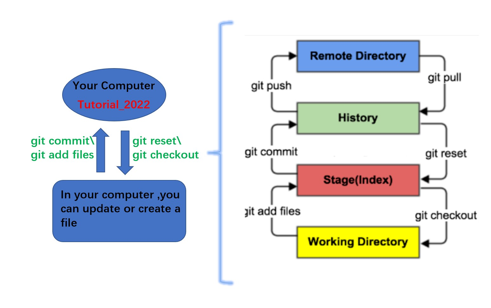
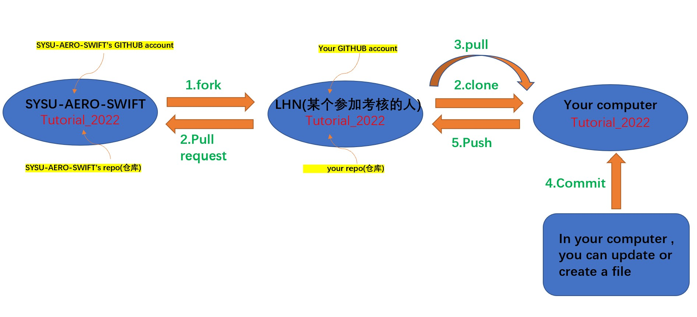

# 基于git和GitHub完成考核任务

Author：@PiCaHor

Revise：@LinHuangnan @hyjack-00 @liangbm3

| 版本 | 说明 |备注|
| ---- | ---- | ---- |
| v0.0.0 | 建立文档 |无|
| v0.1.0 | 添加GitHub基本概念的解释 | @LinHuangnan |
| v1.0.0 | 2023版 | @hyjack-00 |
| v2.0.0 | 沿用之前版本，整理内容 |@liangbm3|

## 1. 前言

该部分将会介绍如何使用 `git` 作为版本管理语言，GitHub作为仓库来进行本次考核。

- 首先会对 `git` 的一些基本概念进行介绍

- 之后将介绍如何在 **Windows** 和**Linux**两个操作系统下完成考核。**Windows**操作系统下更着重于图形化界面的操作，而**Linux**操作系统下更注重命令行操作。如果你的目标是学到完整的项目管理，请专注学习Linux部分

关于 `git` 语言的语法在这里不进行更多的阐述，给出四个学习链接来参考

- [git 官方文档](https://git-scm.com/book/zh/v2) 要养成看官方文档的习惯，有时候官方文档会比网上找的教程覆盖更全面
- [基于 java 的 git 学习网站](https://learngitbranching.js.org/?locale=zh_CN) 这种在线动手实践的资源也可以好好利用
- [B 站上比较好的 git 教程](https://www.bilibili.com/video/BV1pW411A7a5?share_source=copy_web&vd_source=34ed110d766ac5910b35ccc9afedda6e) 视频一类的教程可以更快更直观的建立感性理解和手把手实践
- [个人的博客总结](https://liangbm3.top/2024/10/19/git%E7%9A%84%E4%BD%BF%E7%94%A8%E6%80%BB%E7%BB%93/) 大佬的博客可以提供一些精准的参考，覆盖到官方文档没有列出来的问题

**注** 由于 github 容易出现域名污染，所以可能会出现登不上以及图片加载不成功的情况这里有条件的同学可以科学上网，如果不行请在提交时多试几次，针对图片问题可以将仓库 clone 到本地后进行查看。 

## 2. Git的基本概念

图片暂未更换，2024 年招新考核的仓库实为 `liangbm3/Tutorial_2024`  



**Git本地**有三个工作区域：
+ 工作目录（Working Directory）
+ 暂存区(Stage/Index)
+ 资源库(Repository或Git Directory)

这三个工作区域以及它们与远程仓库（Remote）的关系如上图所示

下面解释一下这几个工作区域：

- `Workspace`：工作区，就是你平时存放项目代码的地方
- `Index / Stage`：暂存区，或者叫待提交更新区，在提交进入本地仓库区之前，我们可以把所有的更新放在暂存区，该区域用于临时存放你的改动，事实上它只是一个文件，保存将要提交到文件列表信息
- `Repository`：仓库区（或本地仓库），就是安全存放数据的位置，这里面有你提交到所有版本的数据。其中HEAD指向最新放入仓库的版本
- `Remote`：远程仓库，即你的Tutorial_2023，托管代码的服务器

###  2.1 Linux下Git的工作流程

1. 在工作目录中添加、修改文件

2. 将需要进行版本管理的文件放入暂存区域(`git add`操作) 

3. 将暂存区域的文件提交到git仓库(`git commit`操作) 

因此，git管理的文件有三种状态：已修改（modified）,已暂存（staged）,已提交(committed)

## 3. GitHub & git 基本概念的说明

图片暂未更换，2024 年招新考核的仓库实为 `liangbm3/Tutorial_2024`



### 3.1 基本流程

假设小明是某位参加考核的人员，为了完成考核，他需要先克隆（执行`fork`操作） SYSU-AERO-SWIFT 的 Tutorial_2024 仓库，此时他的仓库列表里就会出现一个Tutorial_2024 仓库，这两个仓库的内容相同，小明的 Tutorial_2024 仓库其实是 SYSU-AERO-SWIFT 的 Tutorial_2024 仓库的一个副本

但是由于这两个仓库都属于远程仓库，即代码和文件是存在远程的服务器上，因此为了完成考核任务，小明需要把远程的Tutorial_2024仓库克隆（执行`clone`操作）到本地，形成本地的Tutorial_2024仓库，然后根据每一周的任务要求，在本地修改代码，添加文件，然后提交（执行`commit`操作）到本地的Tutorial_2024仓库，但是对本地的Tutorial_2024仓库进行修改并不会改变远程的仓库，因此小明还需要再进行`push`操作，将本地仓库的修改同步到小明的Tutorial_2024,然后再进行`pull request`操作，将修改同步到SYSU-AERO-SWIFT的Tutorial_2024仓库，至此才算成功提交了任务成果

### 3.2 一些重要概念

- `fork` 英语翻译过来就是叉子，动词形式则是分叉,在Github中，fork则可以代表分叉、克隆出一个（仓库的）新拷贝，该拷贝包含了原来的仓库（即upstream repository，上游仓库）所有内容，如分支、Tag、提交，如果想将你的修改合并到原仓库中时，可以通过的`Pull Request`把你的提交贡献回原仓库
- `clone` 将github中的远程仓库克隆到自己本地电脑中
- `commit` 将自己在本地创建或者修改的代码，文件commit（提交）到本地仓库
- `pull`  将远程仓库的数据同步到本地仓库，为了和远程仓库相匹配。举个例子，小明一周之前从远程`clone`了一个仓库到本地，但是在这一周时间内该仓库可能被小红进行了修改，导致远程仓库和本地仓库的内容不同，因此就需要进行一次`pull`操作将数据同步
- `push` 将本地仓库的修改提交到远程仓库
- `pull request` 简称`pr`,在 GitHub 上发送 Pull Request 后，发送过去的 Pull Request 是否被采纳，要由接收方仓库的管理者进行判断。在上图的例子中，小明需要发起一个Pr,然后空队的管理人员将会接受小明发起的pr，接受pr的过程称为`merge`,从而实现小明的Tutorial_2024仓库和SYSU-AERO-SWIFT的Tutorial_2024仓库内容的同步
- `branch` GitHub仓库默认有一个main的分支，当我们在main分支开发过程中接到一个新的功能需求，我们就可以新建一个分支同步开发而互不影响，开发完成后，在合并merge到主分支main上。

**注** 在考核过程中，我们会给每一位参加考核的同学建立一个以该同学名字命名的分支，例如每一个同学只能在自己的名字对应的分支下面完成考核，不得直接在main分支下完成考核，因为只有这样我们才能区分参加考核的同学，并予以评分

## 4. 实际操作指南

### 4.1 Windows下如何提交考核成果

#### 我们给大家录制了[Windows下操作视频教程](https://www.bilibili.com/video/BV15V4y1s7Q6?spm_id_from=333.999.0.0&vd_source=d6011caa82e4385e45ccd7c9fee9d5fe)，大家有时间的话也可以看看

#### 4.1.1 前置准备

- Windows系统
- 较为充足的存储空间
- GitHub Desktop-[下载地址](https://desktop.github.com/)

- github账号

#### 4.1.2 获取仓库

1. 首先来到考核仓库，在右上角点击`Fork`按钮，完成后你就成功的将考核仓库拷贝一份自己的部分，以后你都可以在头像下的Your repositories中找到它
2. 然后打开Github Desktop 在菜单栏中选择File-Clone repository，如图：

    
    选择对应的仓库与保存地址，点击`clone`。至此你的远程仓库就克隆到本地了
3. 接下来你只需要将你完成的内容在对应的文件夹下保存

#### 4.1.3 更新仓库

当你在后续使用的过程中，请留意`Pull origin`按钮是否处于可点击状态
，如图


如果看到，说明远程仓库有更新，可能是我们发布了新的任务或者补充说明，请点击它更新远程仓库的内容

#### 4.1.4 将任务完成成果同步到个人的考核仓库

1. 当你对本地仓库的文件夹下进行编辑后你的所有操作都会被track(跟踪)，在GitHub desktop上会有对应的显示
2. 当你确定好你要提交的内容后（你可以通过取消文件前面的选框来选择部分上传，注意编译过程产生的`*.obj`、 `*.exe`等不用上传，只需要上传源码`*.cpp`文件即可）
3. 下面的过程就是编辑Comment，你需要在头像旁边的summary部分添加简要说明，并可以在Descrption部分添加必要的说明，对于梗概的规定在考试规范中规定

完成后点击`Commit to main`，这样你的更改就被提交到了本地仓库

然后点击主页面上的`Push origin`的按钮，便可以成功将更新推到了个人的远程仓库之中。

#### 4.1.5 提交pr请求合并到空队的考核仓库

当你完成对于所有内容的修改之后来到github上自己fork的仓库

如果你有修改可以看见如图


点击`pull requests` 在页面中点击`New pull request`

在base repository-base中选择自己对应的分支（请注意不要合并到主仓库的main，否则不会予以合并）

然后点击`Create pull request`

在接下来的页面中取消勾选`Allow edits by maintainers`同时在Title与下方添加必要的说明后点击`Create pull request`

**注** 这里再强调一下分支的概念，在本地仓库和自己的考核仓库，你都可以在main分支下面完成考核任务，但是提交Pr请求合并到空队的考核仓库时，在base repository-base中一定要选择与自己名字对应的分支，千万不要选择main分支，否则你的Pr不会被通过

下一个页面中在右侧有五个标签栏：

1. Reviewers: 这里可以 @考核负责人让他们来批改你的工作，请在这里点选所有考核负责人。
2. Assignees: 这里填申请人，也就是你自己。
3. Labels: 对 Issue 和 Pull request 进行分类，每个标签都有对应说明，请按实际情况选择，如果是提交成果，选择 `submit`，如果你是第一次使用这个功能，选择 `First Issue!`，各位会欢迎你的到来。
4. Projects: 忽略
5. Milestone: 忽略。

而后只需小小等待以下冲突检测通过后，便可以联系学长姐将你的提交合并到主仓库你的名字对应的分支中

### 4.2 Linux-Ubuntu下如何提交考核成果

#### 4.2.1 前置准备

- Ubuntu 或者其他的Linux/Unix系统
- github账号

#### 4.2.2 配置git包

1. 打开终端输入以下命令

    ```shell
    sudo apt install git
    ```
2. 等待片刻后，git便安装完毕，然后输入

    ```shell
    git config --global user.name 自己的用户名
    git config --global user.email 邮箱
    ```
3. 下面我们将生成ssh密钥
    ```shell
    ssh-keygen -t rsa -C "(你的邮箱)"
    ```
4. 接下来输入以下命令
    ```shell
    cat  ~/.ssh/id_rsa.pub
    ```
    可以看到终端显示了一串字符串，便是ssh密钥
5. 下面我们将在github中进行关联，打开github在头像位置处选择setting-ssh and GPG keys，然后new ssh key，填写其中的title并把ssh密钥填入key中，然后add即可，回到终端，输入
    ```shell
    ssh -T git@github.com
    ```

依据提示输入yes后出现提示说你的github账户链接成功即可

#### 4.2.3 获取仓库

下面我们将通过ssh获取仓库，首先同Windows一样你需要fork自己的仓库，然后在fork的仓库下面轻触code，并选择ssh，复制地址，然后回到终端输入以下命令

```bash
git clone 复制的内容
```

接下来等待clone完毕便完成了仓库的获取

#### 4.2.4 仓库的更新

请注意仓库的更新非常重要，请每次开始工作之前都进行一次同步，避免出现某些冲突。不过通常情况下由于你们的工作内容同考核仓库会对应隔离，不会出现冲突。

首先来到自己fork下的工作仓库，如果仓库落后了考核库仓库可以看到xxx commit behind的字样，此时选中右边的Sync fork进行同步即可

下面我们将同步我们本地的仓库

1. 来到终端，输入命令
    ```shell
    cd Tutorial_2023
    ```
2. 进入本地仓库，输入
    ```shell
    git pull
    ```
    便可以进行同步

#### 4.2.5 提交

当你完成一天的工作之后，便可以将所有的工作内容上传至本地仓库中

```shell
git add .
```

后面的点号为全部add 你也可以选择部分文件夹进行上传

你可以通过

```shell
git status
```

查看你已经add的内容

下面我们为提交打上commit

```shell
git commit -am "注释内容"
···
git tag -a v1.0.0 -m "tag内容"

```

然后进行push

输入

```shell
git push
```

查看自己的工作仓库可以发现，其内容已经与本地仓库同步

之后就进行提交Pr操作，同Windows部分相同，便不再赘述。
