# 环境配置与准备

Author：@PiCaHor  
Revise：@skyswordx @liangbm3

| 版本     | 说明                     | 备注                                                 |
| ------ | ---------------------- | -------------------------------------------------- |
| v0.0.0 | 建立文档                   | 无                                                  |
| v0.1.0 | 完成Ubuntu虚拟机安装部分        | 无                                                  |
| v1.0.0 | 添加了 WSL 选项来实现 Linux 环境 | WSL 目前直接安装好的裁剪内核驱动无法直接使用 USB 摄像头，需要手动添加内核的编译选项进行编译 | 
| v1.0.1 | 修改了一下文档结构和一些细节 | 无 |

##  前言

该部分将介绍一些基础的环境配置问题

对于虚拟机部分我们采用比较通用的ubuntu系统，由于双系统可能会造成系统不稳定等问题，但是双系统会带来ubuntu系统更好的性能，如果同学有双系统需求请自行安装，这里不加赘述

## Linux 类系统：以虚拟机Ubuntu为例

下面将介绍如何安装Ubuntu系统

### 1. 前置准备

- 激活的VMware Workstation or VirtualBox等搭载平台
- .iso镜像文件-[链接](https://ubuntu.com/download/desktop) 你可以选择18 or 20 新版本的 22版本没有经过测试可能会有环境冲突问题，这里需要各位自己选择版本，如果上述链接下载缓慢，可以选择其他镜像源下载：
  - [清华镜像源](https://mirrors.tuna.tsinghua.edu.cn/ubuntu-releases/)
  - [阿里云镜像源](https://mirrors.aliyun.com/ubuntu-releases/)
- 20G左右的空间，当然这里空间如果比较充足的话可以预分配多一点，如果后面用的多的话拓展空间比较麻烦

### 2. 开始安装

打开Vmware Workstation 选择创建新的虚拟机

然后按下面步骤走

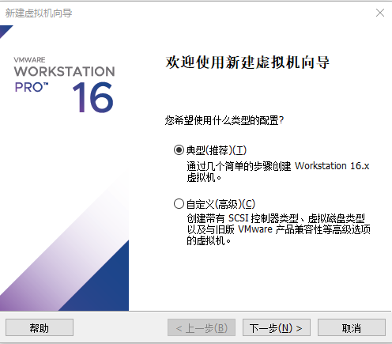

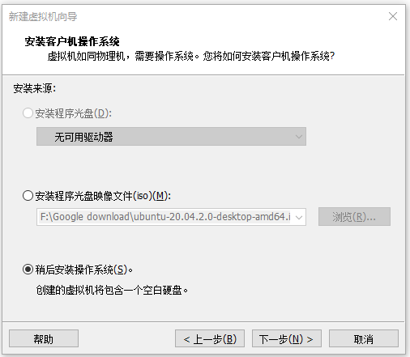

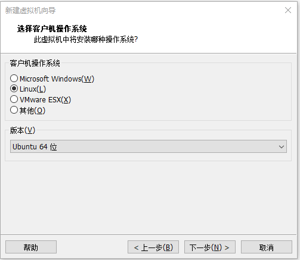

这一步可以自己定义名字和存储路径,请注意用文件夹包括不要直接放在如图所示G盘根目录

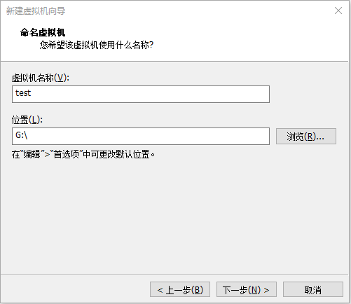

空间大小也请自己视使用状况而定

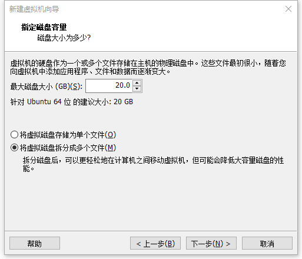

接下来知道完成就可以

然后在完成按钮后，点击左上角编辑虚拟机设置，选择CD/DVD(SATA)栏，选择使用ISO映像文件并浏览定位至刚刚下载的映像文件位置,然后确认

完成后如图

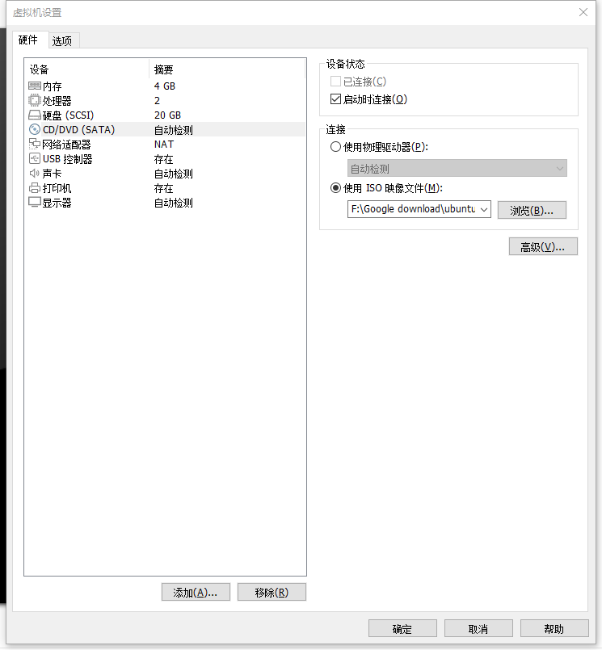

然后开启虚拟机进行系统的安装

中间过程需要经历比较长时间的安装，请耐心等待

下面进入系统设置，推荐使用英文安装，为了根目录比较容易使用，当然中文系统也是可以的

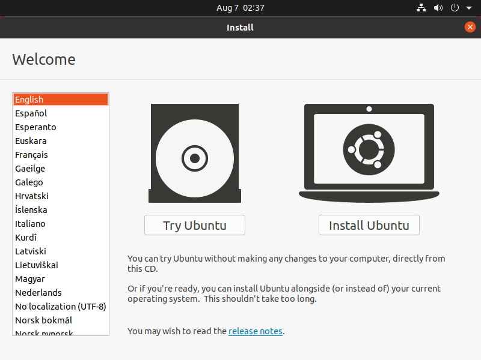

选择install ubuntu

下一个栏目是键盘语言选择，这里按你的心意选择即可直接下一步

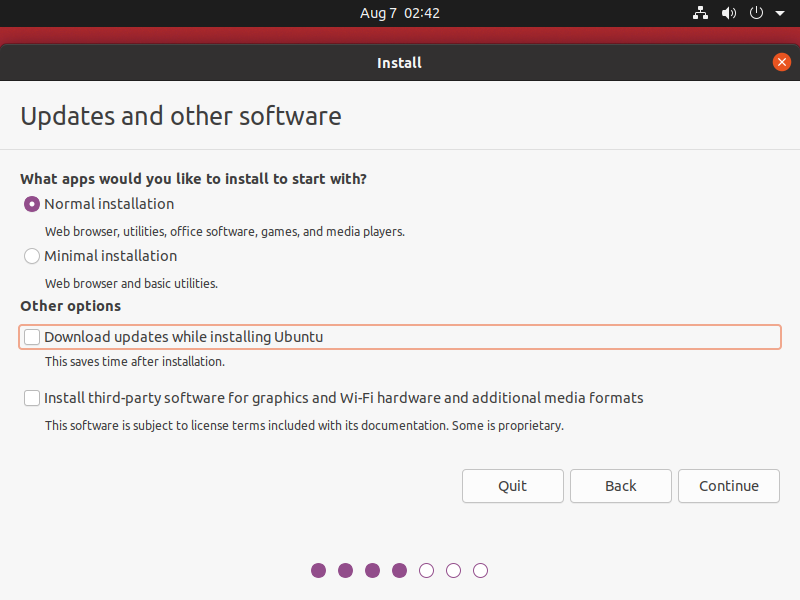

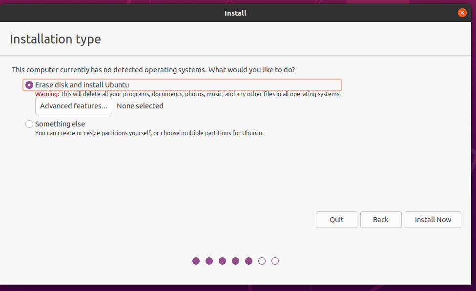

下一步的地区选择没有意义

然后最后一步是对于用户名密码的设置,重复密码下面的两个分别代表直接登录系统还是需要密码验证，关于这一点也是根据你的喜好而定。然后你便需要等待相当一会儿时间后，你的Ubuntu系统便安装完成了

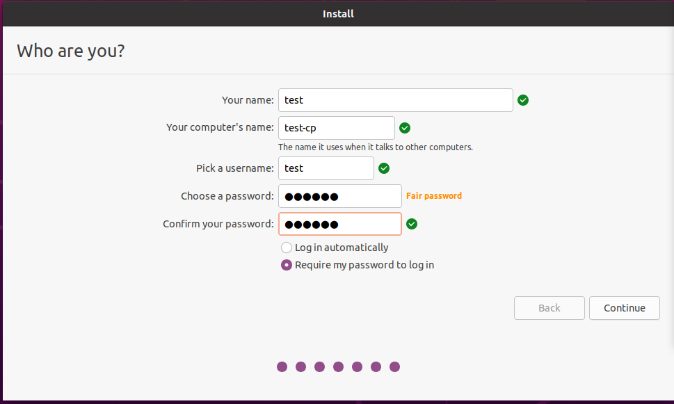

另外推荐安装VMware Tools 会带来许多的方便这里由于不是必须要的，不做更多的赘述，有需要的同学请自行查询安装教程。

安装完成后等待重启就可以进入你的系统了

### 可能会遇到的问题和之前解决时搜索到的链接

这是我自己安装时遇到的一系列问题和对应解决时参考的链接

[安装vmtools来让屏幕变宽](https://cloud.tencent.com/developer/article/2091194)

[提取压缩包文件时出错](https://www.cnblogs.com/why-2019/p/13570606.html#:~:text=%E5%9C%A8%E5%AE%89%E8%A3%85VMware%20Tools%E6%97%B6%E5%87%BA%E7%8E%B0%E6%8F%90%E7%A4%BA%E2%80%9C%E6%B2%A1%E6%9C%89%E8%B6%B3%E5%A4%9F%E7%9A%84%E5%8F%AF%E7%94%A8%E7%A9%BA%E9%97%B4%E6%8F%90%E5%8F%96VMwareTools-10.3.2-9925305.tar.gz%E2%80%9D%E3%80%82%20%E8%A7%A3%E5%86%B3%E6%96%B9%E6%A1%88%EF%BC%9A,1%E3%80%81%E5%8F%B3%E5%87%BBVMwareTools-10.3.2-9925305.tar.gz%EF%BC%8C%202%E3%80%81%E7%82%B9%E5%87%BB%E2%80%9C%E7%94%A8%E5%BD%92%E6%A1%A3%E7%AE%A1%E7%90%86%E5%99%A8%E6%89%93%E5%BC%80%E2%80%9D%203%E3%80%81%E7%82%B9%E5%87%BB%E6%8F%90%E5%8F%96%E6%8C%89%E9%92%AE%EF%BC%9B%E9%80%89%E6%8B%A9%E6%8F%90%E5%8F%96%E7%9A%84%E4%BD%8D%E7%BD%AE%E5%8D%B3%E5%8F%AF%E6%8F%90%E5%8F%96%E5%88%B0%E6%8C%87%E5%AE%9A%E7%9A%84%E4%BD%8D%E7%BD%AE%E3%80%82)

[解决无法把文字复制进去虚拟机里面](https://blog.csdn.net/qq_51741730/article/details/119795854)

## Linux 类系统：以 WSL2 的 ubuntu 系统为例

目前只要是 windows 10 或者 11 以上，都支持 WSL (Windows Subsystem Linux) 的形式来构建 Linux 环境

使用 WSL 的好处就是可以在一个系统下面最大化地利用到硬件的性能，比起虚拟机来说，WSL 的性能会更好一些。

主要参考链接：[安装 WSL | Microsoft Learn](https://learn.microsoft.com/zh-cn/windows/wsl/install)
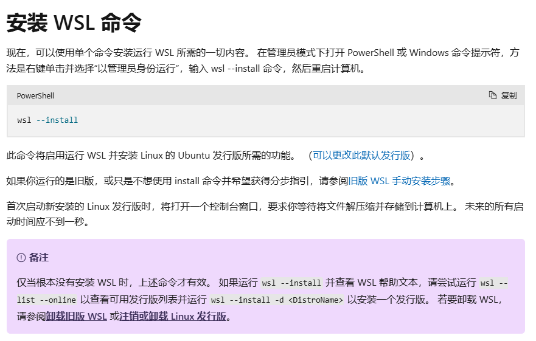


建议参考上述的微软文档进行操作，因为现在的 WSL 版本已经升级到了 2，而 WSL 2 的安装方式和 WSL 1 有所不同，是在终端中运行十分简单的命令就可以开启

并且网上的教程大部分已经过时了，如果按照他们的教程在安装中卡住的话，会导致微软文档的一键安装也无法成功，所以请第一次操作时务必参考微软文档进行操作
##  WSL 进阶：让 Windows 主系统的 USB 摄像头可以连接并识别到 WSL 子系统中


### 0. 前言和参考链接

**注意，这里实践的难度会比较大，请谨慎分配时间
这里也不是考核必须的内容，只是提供给想在WSL中使用主机USB设备比如USB摄像头的同学一种我们摸索出来的解决方案**

放在这里主要是面向视觉组选择使用 WSL 作为 Linux 环境的同学，但其实考核的内容也不一定会涉及到连接主机摄像头

因为微软的 Linux 内核是被裁剪过的内核，这个内核其实并没有编译 USB 摄像头驱动
导致 WSL 2 的系统无法认识 USB 摄像头这个设备

但是原生的 Linux 系统是可以识别 USB 摄像头的，所以我们可以通过进入 WSL 内核的编译选项进行更改，然后重新编译一个有摄像头驱动版本的 WSL 的内核来解决这个问题

一旦 WSL 有了摄像头驱动以后，就可以通过 usbip 这个工具进行 ip 映射来让 WSL 子系统连接并识别主机的 USB 摄像头了（没重新编译之前是可以连接，但无法认识和使用设备）

[参考0:修改WSL2内核以支持实时调度和UVC摄像头](https://zhuanlan.zhihu.com/p/509248038)

[参考1:如何让WSL2使用自己编译的内核](https://zhuanlan.zhihu.com/p/324530180)

[参考2:WSL2编译内核并更改替换内核版本](https://blog.csdn.net/qq_45698138/article/details/134655673)

[github上关于WSL调用摄像头的issue](https://github.com/microsoft/WSL/issues/6211)

[推荐的油管编辑menuconfig的教程](https://www.youtube.com/watch?v=t_YnACEPmrM)

可以考虑使用命令行 make 命令配合修改 config 文件编译，或许会好一点

### 1. 确认要下载的内核版本和 config 配置文件版本

注意要先确认 [WSL 的内核版本](https://github.com/microsoft/WSL2-Linux-Kernel/releases) 和 [config配置文件版本，一般在Microsoft文件夹里有指路](https://github.com/microsoft/WSL2-Linux-Kernel/blob/linux-msft-wsl-5.15.y/arch/x86/configs/config-wsl)，注意要相匹配，最好都要从 github 上面下载


我尝试过版本 5.15.137.3 的内核版本配 5.15.137.1 的配置文件，可以完成下面的操作

也试过 5.10.10 x 的内核版本配相应的配置文件，但卡住在 `menuconfig` 中找不到 `media usb adapter` 这一项

### 2. 下载 WSL 2 内核

这一步要在 WSL 2 中新建一个专用的文件夹，并进入
把 WSL 2 内核源码仓库搞到这个文件夹里面
```shell
>> mkdir ~/kernel
>> cd ~/kernel
在这个kernel文件夹放内核源码仓库
```

option 1:
要是相信自己网速的话就直接 git 克隆官方 github 仓库
```shell
>> VERSION=5.15.137.3
>> sudo git clone -b linux-msft-wsl-${VERSION} https://github.com/microsoft/WSL2-Linux-Kernel.git ${VERSION}-microsoft-standard && cd ${VERSION}-microsoft-standard
```


option 2:
可以在官网下载 zip 压缩包并在这里解压


### 3. 下载内核的配置文件

.config 配置文件是用于指导 make 编译的，这一步要在内核仓库里面搞一个配置文件

option 1
在内核仓库里面创建一个. config 文件，内容来自官方 github 仓库的参考文件
```shell
>> touch .config
>> sudo vim .config
>> ... ctrl-v
```

option 2
要是自己原来的内核版本看起来大概符合要求（比如知识大于 5.10. x）可以在直接选择自己内核版本的源码仓库，相应的配置文件可以从本机获取
```shell
>> sudo cp /proc/config.gz config.gz
>> sudo gunzip config.gz
>> sudo mv config .config
```

### 4. 实时内核补丁安装

再下载相应的实时 RT_PREEMPT 补丁，记住一定要和内核版本号匹配，补丁下载链接（TODO）

回到内核仓库文件夹的上一级文件夹（也就是 kernel 文件夹），把 RT_PREEMPT 补丁解压到内核文件夹
```shell
>> cd ~/kernel/
>> gunzip patch-xxx.patch.gz
```

进入内核仓库文件夹，安装补丁
```shell
>> cd ~/kernel/内核仓库文件夹
>> patch -p1 < ../patch.xxx(具体的名字看你补丁解压之后的名字)
```

### 5. 编辑 config 文件

在内核仓库文件夹输入 `sudo make menuconfig` 命令，进入下图页面，更改下面选项
```
Build WSL2 kernel with usb camera support
menuconfig -> Device Drivers -> Multimedia support -> Filter media drivers
           -> Device Drivers -> Multimedia support -> Media device types -> Cameras and video grabbers
           -> Device Drivers -> Multimedia support -> Video4Linux options -> V4L2 sub-device userspace API
           -> Device Drivers -> Multimedia support -> Media drivers -> Media USB Adapters   -> USB Video Class (UVC)
           -> Device Drivers -> Multimedia support -> Media drivers -> Media USB Adapters   -> UVC input events device support
           -> Device Drivers -> Multimedia support -> Media drivers -> Media USB Adapters   -> GSPCA based webcams
```

之后再按 `/` 去查看搜索 `UVC`，查看相应的 `[n]` 是否都变成 `[y]`，注意看相应的项以及它的 `location`，应该是还要再改一个叫做 `usb gabget through...` 之类的东西
这样 UVC 驱动应该就可以被编译进内核了


然后是选择编译实时补丁
```
# Enable CONFIG_PREEMPT_RT  
-> General Setup  
-> Preemption Model (Fully Preemptible Kernel (Real-Time))  
(X) Fully Preemptible Kernel (Real-Time)


# Enable CONFIG_HIGH_RES_TIMERS 
-> General setup  
-> Timers subsystem  
[*] High Resolution Timer Support


# Enable CONFIG_NO_HZ_FULL  
-> General setup  
-> Timers subsystem  
-> Timer tick handling (Full dynticks system (tickless))  
(X) Full dynticks system (tickless)


# Set CONFIG_HZ_1000 (note: this is no longer in the General Setup menu, go back twice)  
-> Processor type and features  
-> Timer frequency (1000 HZ)  
(X) 1000 HZ


# Set CPU_FREQ_DEFAULT_GOV_PERFORMANCE [=y] 
-> Power management and ACPI options  
-> CPU Frequency scaling  
-> CPU Frequency scaling (CPU_FREQ [=y])  
-> Default CPUFreq governor (<choice> [=y])  
(X) performance
```

### 6. 准备编译

至此，内核就已经配置成功了

如果想要修改内核版本号，可以修改 Makefile 文件
```shell
>> sudo vim Makefile
```

如果想修改内核名，可以修改. config 文件
```shell
>> sudo vim .config
```


然后再安装 Linux 内核编译工具
```shell
>> sudo apt upgrade
>> sudo apt update
>> sudo apt-get build-dep linux
>> sudo apt-get install libncurses-dev flex bison openssl libssl-dev dkms libelf-dev libudev-dev libpci-dev libiberty-dev autoconf fakeroot

```


编译模块，这里的 -j 4 是指用几个 CPU 核心编译，我只给 WSL 2 分配了 4 个核，所以这里选 4
```shell
>> sudo make modules -j4
```

安装模块
```shell
>> sudo make_modules_install
```

查看是否安装成功
```shell
tree /lib/modules
```

最后编译内核
```shell
sudo make -j4
```


### 7. 更换启动内核

我们只要在 `内核仓库/arch/x86/boot/` 的 bzImage 内核镜像文件就够了，把她保管好

然后复制到一个你喜欢的地方，然后再复制一份 `C:\windows\system32\lxss\tools\` 这个文件夹里面

之后在 `C:\用户(user)\你的用户名\` 这个文件夹里面新建一个. wslconfig 文件
再在里面指定 WSL 2 的启动内核
```
[wsl2]
kernel=C:\\Windows\\System32\\lxss\\tools\\bzImage
```

之后进入 powershell，重新启动 WSL 即可，可以在 WSL 里面用 `uname -r` 或者 `neofetch` 检查
```powershell
>> wsl --shutdown
>> wsl
```

### 8. 使用 USBIP 来连接主机 USB 设备

windows 端和 WSL_linux 端的配置参考[微软官方教程](https://learn.microsoft.com/en-us/windows/wsl/connect-usb)就够了

